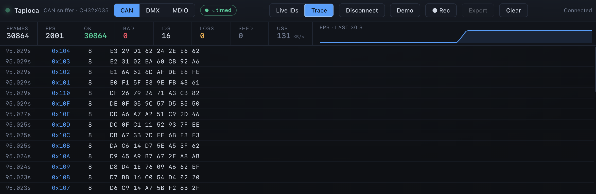
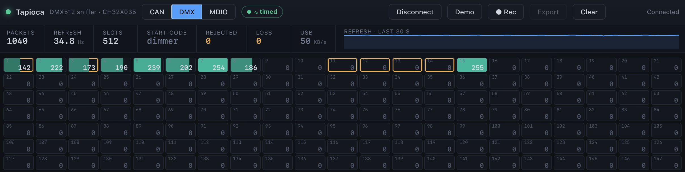

# ch32-tapioca

**A sub-€1 USB logic analyzer for 1- and 2-wire buses, built on the CH32X035 PIOC.**

Taps a logic-side bus signal and decodes it live in the browser. **Tested on CAN, DMX & MDIO.** Throughput supports
~1 Mbps (non-clocked) / ~3 MHz (clocked). Signal *generation* (driving a bus / emulating protocols, not just
listening) is planned.

<table>
  <tr>
    <td align="center" width="50%">
      <br>
      <sub>CAN live ID view</sub>
    </td>
    <td align="center" width="50%">
      <br>
      <sub>CAN trace view</sub>
    </td>
  </tr>
  <tr>
    <td align="center" width="50%">
      <br>
      <sub>MDIO register/MMD view</sub>
    </td>
    <td align="center" width="50%">
      <br>
      <sub>DMX512 universe view</sub>
    </td>
  </tr>
</table>

Disclaimer: this is an experimental / research project. The goal is to be genuinely useable, but treat it as such.

## Why

The whole thing rides on one cheap part: the **WCH CH32X035**, a 48 MHz RISC-V MCU:
- Dirt cheap (≤ €0.25)
- Needs almost no external components (built-in oscillator) 
- Tiny QFN 3x3 package
- Native USB 2.0 FS (12 Mbps)
- And unusually at this price, a **PIOC**: a minimal coprocessor that can follow a bus edge-by-edge while
the CPU does the housekeeping and data transmission.

It started as a need: an **ultra low-cost embedded USB↔MDIO bridge** to monitor/configure the
Ethernet PHYs in an SPE media converter (two PHYs back-to-back). The PIOC turned out to be the perfect
peripheral to passively follow an external clock, drive
one, and parse/send data frames with tight timing, so the question became: *can it be turned into a general-purpose logic tool?*

The PIOC is comparable to the RPi Pico's PIO, but:

- it's a full little RISC8 core (more capable per instruction)…
- …and also more constrained: 48 MHz, a single core (no parallel state machines),
  only **2 IO pins**, and **~30 bytes** of register file shared with the CPU.
- it's programmed in its own assembly, with sparse docs and a Windows-only vendor toolchain (this repo ships a small Python assembler so you don't strictly need it).

So this is mostly a real-time engineering exercise: *how much useful capture can we wring
out of that?*

Reference dev board used for testing: [WeAct Studio CH32X035 Core Board](https://github.com/WeActStudio/WeActStudio.CH32X035CoreBoard)
(< €2).

## How it works

```
  bus line
     │
     ▼
    PIOC    sample the line at a high, repeatable rate;
  (coproc)  pack the result into a shared FIFO
     │
     ▼
    CPU     drain the FIFO into a RAM ring → stream out
     │
     ▼
  USB-CDC   one binary stream (up to ~500 KB/s)
     │
     ▼
    host    browser decodes live; Python decodes saved
            captures, recovering the clock from the data
```

Two capture modes, picked at runtime (the host sends `!mode rle|clocked`):

| mode | for | what the PIOC streams |
|---|---|---|
| **`clocked`** | buses with a clock line (MDIO, SPI…) | the data line **sampled** on each clock edge → logic levels |
| **`rle`** | unclocked / asynchronous NRZ buses (CAN, DMX, LIN, UART…) | **RLE = run-length encoding**: how many ticks the line stayed at a level (host recovers the clock from the data) |

All protocol decoding happens **host-side**, so the same capture is protocol-agnostic.
There's no kernel driver, decoding is a userspace lib in JS (browser) and Python, plus the shared C++ codec headers.

**Numbers**:

- Host throughput caps at **~500 KB/s** (CPU-bound on the drain↔USB path).
- Holds **classic CAN @ 1 Mbps** *(real bus)*: ~8000 frames/s of typical traffic, and **6000 frames/s worst case** (a `0101…` payload : transition every bit, shortest bit duration).
- Timing resolution **±100 ns**.
- Clocked capture is clean end-to-end to **~3 MHz**; a real MDIO bus runs ~1.5 MHz. (The clocked PIOC blob has passed isolated SPI-loopback tests at 6 MHz; ~3 MHz is the conservative product ceiling once CPU drain, USB framing and host decoding are included.)

The project builds with PlatformIO using the `ch32v` platform / `noneos-sdk` framework.

## Hardware

- **Board:** `genericCH32X035F8U6` (QFN20). CH32X035 = 48 MHz RISC-V, USB-FS device.
- **Tap pins** (logic-level side of the bus, not the differential CAN/RS485 pair):
  - data → `PC19` (PIOC IO1, used in both modes)
  - clock → `PC18` (PIOC IO0, `clocked` mode only)
  - common ground
  - for CAN/DMX, put the usual transceiver in front and tap the RXD/RO logic output
- **USB-CDC** is on `PC16/PC17`. **LED** on `PB12` (heartbeat).
- **Flashing: USB bootloader only.** The PIOC uses `PC18/PC19`, which are also the chip's SWD/SDI debug pins (DIO/CLK), so SWD debug/flash are unavailable. Flash over the USB bootloader instead: 
  1. plug the board in while holding the BOOT button, and it enumerates as the WCH bootloader
  2. `pio run -t upload` (`upload_protocol = isp`) detects and flashes it, no debug probe

## Build & run

Firmware (PlatformIO):

```sh
pio run -e sniffer -t upload  # the product: both modes + runtime !mode switch
```

Then decode it in the browser, Chrome/Edge (Web Serial). The dashboard handles both capture modes and auto-detects the active one:

```sh
open app/index.html           # then click "Connect" and pick the serial port
```

`scripts/` holds **offline** Python decoders (capture a file, then decode it) + a throughput probe, for CLI/CI, not live (the browser app is the realtime decoder).

Build environments (`platformio.ini`):

| env | what |
|---|---|
| `sniffer` *(default)* | the product: both datapaths + runtime `!mode rle\|clocked` |
| `rle_sniffer` | RLE datapath only, with `DIAG` telemetry (re-validate a bus) |
| `clocked_sniffer` | clocked datapath only, with `DIAG` telemetry |

(`test_rle_tick` is a bench env that measures the RLE blob's per-level tick period, see `src/sniffer/rle_tick_test.hpp`.)

Host tests: `bash app/test/run_all.sh` - the codec/framing/mode tests need Node + a C++ compiler; the dashboard smoke test additionally needs Chrome (Web Serial / CDP). No hardware required.

## Protocols tested

| protocol | kind | notes / test setup |
|---|---|---|
| SPI | clocked | the dev loopback: SPI1 generates known waveforms (PA5/PA7 jumpered to the tap pins) to sanity-check capture without an external bus |
| MDIO | clocked | the original use case: watch Linux monitor/control Ethernet PHYs. Sniffed on a USB↔SPE (10BASE-T1L) dongle, full Clause-22 + MMD decode. Active MDIO generation is planned, not in this capture firmware yet |
| CAN (classic, 1 Mbps) | RLE | a very cheap CAN analyzer. Tested against an ESP32 (TWAI) and a real bus with QDD motors through an SN65HVD230 CAN PHY |
| DMX (250 kbps) | RLE | handy DMX-line debugger. Tested against an ESP32 (EZDMX) and real lighting drivers over an RS485 transceiver |

## The USB wire protocol (API)

The device speaks a small binary envelope over USB-CDC. One byte, `0xFF`, is the
universal segment boundary. In raw `rle`, bytes `0x81..0xFF` are free for sentinels
because run data only uses `0x00..0x80`; in `clocked`, `0xFD` / `0xFE` are control
bytes only when they start a `0xFF`-delimited segment.

### Device → host

The active mode is self-describing: the device periodically emits a `[MODE ...]`
metadata block. The `wire=2` field is a format-version tag so hosts can reject or
adapt to future envelope changes.

#### Common sentinel bytes

| byte / block | meaning |
|---|---|
| `0xFF` | segment boundary / hard cut |
| `0xFD` | capture loss marker: bytes were dropped here; do not decode across it |
| `0xFE '[' ascii... ']' 0xFE` | metadata block, e.g. `[MODE ...]` or `[T ...]` diagnostics |

The metadata segment itself is:

```text
FE "[MODE clocked wire=2]" FE FF
FE "[MODE rle wire=2 thi=9 tlo=8 fcpu=48000000]" FE FF
```

Timing:

- At mode start, both datapaths emit an immediate `[MODE ...]` marker.
- In `clocked`, the marker is queued as a standalone `0xFF`-terminated segment,
  between records, then repeated about once per second.
- In `rle`, the periodic marker is only emitted after an idle boundary, when no
  run-byte frame is in flight. On the wire this commonly looks like:

```text
... FF  FE "[MODE rle ...]" FE FF  ...
    │   └─ metadata segment ─┘
    └─ idle boundary that closed the previous RLE frame
```

So the two stream shapes are:

```text
clocked:
  FF  FE "[MODE clocked...]" FE FF <COBS-record> FF <COBS-record> FF  ...
      └──── mode metadata ────┘   └── record ───┘  └── record ───┘

rle:
  FF  FE "[MODE rle ...]" FE FF <run-bytes> FF  <run-bytes> FF  ...
      └── mode metadata ───┘    └─ frame ─┘     └─ frame ─┘
```

With `-D DIAG`, `[T ...]` diagnostics use the same `0xFE ... 0xFE` metadata shape.
In `clocked` they are standalone `0xFF`-terminated segments. In `rle` they may be
inserted inline in the run-byte stream, without adding a `0xFF`; hosts strip the
paired `0xFE ... 0xFE` block before reconstructing runs.

#### RLE mode: raw run-byte stream

RLE mode is not record-framed and does not use COBS. It is a raw stream of
alternating run durations plus sentinels.

How to read run-bytes:

- Bytes `0x00..0x7F` end the current run. Their value is the last chunk of the run.
- Byte `0x80` means: “this same run is still going; add 128 ticks and keep the same level”.
- So a run is: zero or more `0x80` bytes, followed by one byte `< 0x80`.
- Total run length = `128 × number_of_0x80_bytes + final_byte`.

Examples:

| bytes | decoded run length | what happens next |
|---|---:|---|
| `06` | 6 ticks | run ends, level flips |
| `80 2C` | 128 + 44 = 172 ticks | run ends, level flips |
| `80 80 2C` | 128 + 128 + 44 = 300 ticks | run ends, level flips |

- The special case is long idle: after enough consecutive `0x80` bytes, the firmware emits
  `0xFF` as an idle boundary and drops the rest of that idle run. In that case the idle run
  does **not** need to end with a byte `< 0x80` on the wire.
- Run-bytes do **not** carry HIGH/LOW. The protocol decoder anchors the first
  level: CAN starts at SOF dominant/LOW; DMX idles HIGH then BREAK is LOW.
- `0xFF` is a hard boundary inserted by the firmware on long idle.
- `0xFD` is a hard boundary caused by capture loss.

Example, shortened for readability:

```text
06 0C 06 80 80 ... 80 FF
│  │  │  └───────────┘ └─ idle boundary
│  │  │       long idle run, emitted as many 0x80 continuation bytes
│  │  └─ run C = 6 ticks, then flip level
│  └──── run B = 12 ticks, then flip level
└─────── run A = 6 ticks, then flip level
```

With the default `RLE_MIN_KBPS=5`, the idle squelch threshold is
`CAP_IDLE_K=150`: the firmware forwards the first 149 idle `0x80` bytes, emits
one `0xFF` instead of the 150th, then drops the rest of that idle run until the
line moves again. So `0xFF` means “idle boundary”, not “the previous run ended
exactly here”.

#### `clocked` mode: COBS-`0xFF` records

`clocked` mode is record-based. Every data record is:

```text
COBS-FF(raw_record) FF
```

The raw record layout is little-endian:

| offset | field | bytes in the example | meaning |
|---:|---|---|---|
| 0 | `type` | `01` | sampled-data record |
| 1..4 | `t_us` | `e8 03 00 00` | start timestamp = 1000 µs |
| 5..6 | `dur_us` | `c8 00` | burst duration = 200 µs |
| 7..8 | `onset_us` | `26 00` | time to the early clock-estimation point = 38 µs |
| 9 | `flags` | `00` | bit0 PIOC overflow, bit1 RAM overflow, bit2 continued |
| 10..11 | `n` | `02 00` | payload length = 2 bytes |
| 12.. | `payload` | `a5 5a` | clock-sampled data bytes |

That example record before COBS is:

```text
01 e8 03 00 00 c8 00 26 00 00 02 00 a5 5a
```

Because this particular raw record contains no `0xFF`, the COBS-`0xFF` encoding is
just one prefix byte plus the payload, then the boundary:

```text
0f 01 e8 03 00 00 c8 00 26 00 00 02 00 a5 5a FF
```

If the sampled payload contains `0xFF`, COBS-`0xFF` escapes it so `0xFF` remains
only a segment boundary. If a burst exceeds the firmware record cap, `flags&0x04`
marks the record as `continued`; the host joins continued records before protocol
decode.

### Host → device

| line | meaning |
|---|---|
| `!mode rle\n` / `!mode clocked\n` | switch the capture mode (strict parse: a malformed line is ignored, so line noise can't trigger a reconfig) |

The host owns the protocol↔mode mapping (CAN/DMX → RLE, MDIO/SPI → clocked) and all
decoding; the device only knows the two modes. (The browser UI labels the RLE mode
**"timed"** for humans; on the wire it's `rle`.)

### Diagnostics

Built with `-D DIAG`, the device adds a `[T …]` telemetry block
(~1 Hz) inside the same `0xFE`-framed envelope - **off by default** so the capture stream
stays clean. The fields differ by mode:

- **RLE** reports the full drain path including the
  TIM3 ISR cost (`drnCpu`) and PIOC-ring margin (`maxGap`)
- **clocked** reports loop/USB
  throughput and overflow (no `drnCpu`/`maxGap` - it drains from the main loop, not an ISR).

Watch it live with:

```sh
python3 scripts/diag_monitor.py /dev/cu.usbmodemXXXX
```
(it also prints the `[MODE …]` heartbeat, which is always on). The `rle_sniffer` / `clocked_sniffer` build envs enable `DIAG` by default for exactly this bus-revalidation use.

## Tips & gotchas (from the bring-up)

Real-time on this chip is mostly about *not* paying hidden latencies - and proving
which latency you are actually paying:

- **Keep exactly one hard interrupt.** On CH32V, the WCH `interrupt-fast` path did not
  give us useful nested USB-vs-TIM3 preemption in practice. The stable shape is:
  TIM3 is the only time-critical ISR, at 50 kHz for RLE, and USB is polled from the
  main loop. That keeps the PIOC drain deterministic instead of occasionally being
  blocked by a CDC transaction.
- **Run the hot path from RAM, and keep it boring.** The TIM3 drain ISR, the RLE
  `service()` drain and the USB bulk-IN `pump()` live in `.highcode` (RAM). Leaving
  the hot drain in flash was enough to cripple throughput by itself: during bring-up,
  moving the drain path to RAM took a drain loop from ~1.5 kHz to ~14 kHz before the
  later USB/drain rewrites. The ISR itself only copies the PIOC DATA-register FIFO into
  a RAM ring and gets out; idle squelch, `0xFF` boundaries, metadata and USB backpressure
  all live in the main-loop `service()` path. On the validated 30-slot RLE ring,
  worst-case CAN sits around `maxGap` 19-20/30, below the overflow ceiling.
- **Skip expensive SDK helpers in the ISR.** Clearing TIM3 directly (`INTFR = ~flag`)
  avoids `TIM_GetITStatus` / `TIM_ClearITPendingBit` calls that cost a few microseconds
  each when not inlined. At a 50 kHz drain rate, those helper calls alone can eat most
  of the CPU budget; the bad version measured ~95% CPU in the drain path and starved the
  main loop to ~800 Hz.
- **USB throughput was an `INT_BUSY` cadence problem, not a host-driver problem.** The
  USBFS engine auto-NAKs while `UIF_TRANSFER` is pending. If you only clear/re-arm it
  once per main-loop pass, you get the "one packet per loop" ceiling. Interleaving
  `usb_.pump()` every 16 drained bytes shrinks that freeze window from a whole loop
  (~180 µs during the CAN bring-up) to roughly the drain chunk time (~10 µs), taking the
  stream near the ~500 KB/s device-side ceiling (beyond that CPU is the bottleneck).
- **For RLE, the cliff is the publish blind window, not the counting loop.** The PIOC
  can count a level quickly, but every transition has a short store/publish sequence
  where it is not looking at the pin. At CAN 1 Mbps, one bit is 48 CPU cycles and this
  is still inside the green zone; at higher transition densities it is the thing that
  makes runs merge. The host's per-level clock recovery then absorbs the fixed bias that
  remains.
- **RLE timing is per-level.** The HIGH and LOW counting loops are not the same length
  (currently 9 and 8 CPU cycles/tick, measured by `test_rle_tick`). The device advertises
  that in `[MODE rle ... thi=9 tlo=8 fcpu=48000000]`; hosts should fit LOW/HIGH runs
  separately and convert to absolute baud from those slopes, not from a single average.
- **The PIOC-specific gotchas** (mid-bit sampling, the real 48 MHz clock, `BCTC` = 2
  cycles, 30-slot non-power-of-two rings, and torn-read-free HEAD publishing) live where
  they belong, in [`pioc/README.md`](pioc/README.md).

Rough performance envelope: CAN 1 Mbps > 8000 fps typical, DMX (44 Hz / 250 kbps) trivial,
clocked clean to ~3 MHz.

## Layout

| path | what |
|---|---|
| `src/` | firmware (PlatformIO, `framework = noneos-sdk`) |
| `src/sniffer/` | the two datapaths (`RleSniffer`, `ClockedSniffer`) + wire helpers (`mode_command`, `record_framer`) |
| `src/{usb,hal,util}/` | USB-CDC · SDK + ISRs · ring/cobs/led/spi-gen |
| `pioc/` | the PIOC capture blobs (`clocked_sniffer`, `rle_sniffer`) + `assemble.py` (a small native assembler for the PIOC `.ASM` files) |
| `app/` | the Web Serial browser dashboard + its Node/C++ test suite |
| `scripts/` | offline Python decoders (CLI/CI) + throughput probe + `diag_monitor` |
| `ldscript/` | custom linker (reserves the top 4 KB of RAM for the PIOC program ROM) |

## Status & next

**Done:** lossless capture of both clocked and clockless buses, validated end-to-end on real
MDIO, CAN and DMX traffic; a runtime mode switch; a single binary wire protocol; and a
browser dashboard that decodes it live, plus offline Python decoders for captured files.

**Next:**

- **Generation** - make the PIOC *drive* a bus, not just listen: the host sends a frame,
  the device clocks it out. (This is the other half of the original MDIO-bridge idea: a
  USB↔MDIO master that can read/write any PHY register.)
- Refine the two measurement primitives (run-length vs clock-sampled) and push the
  clocked ceiling.
- More protocols (LIN, UART/RS485 auto-discovery, DALI, IR data...) - they fit the existing RLE/clocked split.
