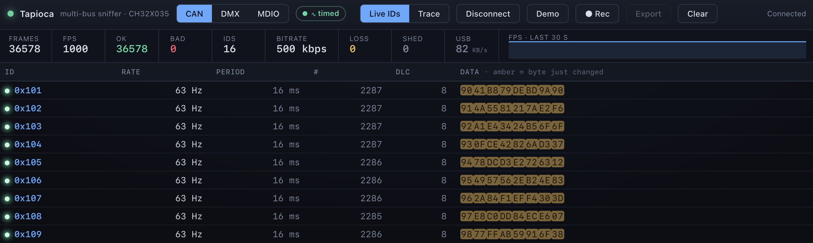
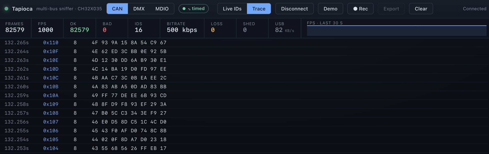
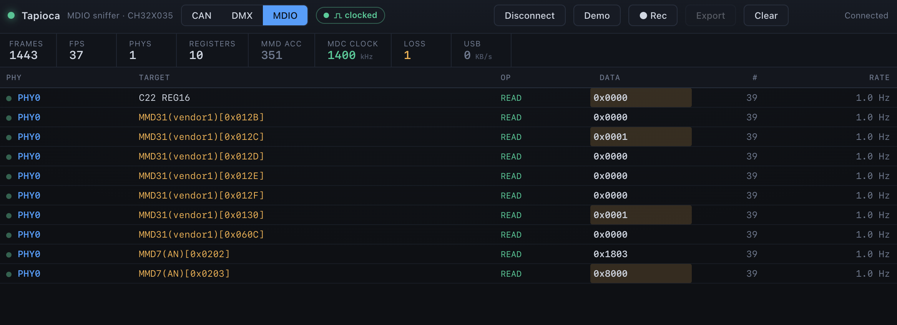

# ch32-tapioca

**A sub-€1 USB logic analyzer for 1- and 2-wire buses, built on the CH32X035 PIOC.**

Taps a logic-side bus signal and decodes it live in the browser. **Tested on CAN, DMX & MDIO.** Throughput supports
~1 Mbps (non-clocked) / ~3 MHz (clocked). Signal *generation* (driving a bus / emulating protocols, not just
listening) is planned.

<table>
  <tr>
    <td align="center" width="50%">
      <br>
      <sub>CAN live ID view</sub>
    </td>
    <td align="center" width="50%">
      <br>
      <sub>CAN trace view</sub>
    </td>
  </tr>
  <tr>
    <td align="center" width="50%">
      <br>
      <sub>MDIO register/MMD view</sub>
    </td>
    <td align="center" width="50%">
      <br>
      <sub>DMX512 universe view</sub>
    </td>
  </tr>
</table>

Disclaimer: this is an experimental / research project. The goal is to be genuinely useable, but treat it as such.

## Why

The whole thing rides on one cheap part: the **WCH CH32X035**, a 48 MHz RISC-V MCU:
- Dirt cheap (≤ €0.25)
- Needs almost no external components (built-in oscillator) 
- Tiny QFN 3x3 package
- Native USB 2.0 FS (12 Mbps)
- And unusually at this price, a **PIOC**: a minimal coprocessor that can follow a bus edge-by-edge while
the CPU does the housekeeping and data transmission.

It started as a need: an **ultra low-cost embedded USB↔MDIO bridge** to monitor/configure the
Ethernet PHYs in an SPE media converter (two PHYs back-to-back). The PIOC turned out to be the perfect
peripheral to passively follow an external clock, drive
one, and parse/send data frames with tight timing, so the question became: *can it be turned into a general-purpose logic tool?*

The PIOC is comparable to the RPi Pico's PIO, but:

- it's a full little RISC8 core (more capable per instruction)…
- …and also more constrained: 48 MHz, a single core (no parallel state machines),
  only **2 IO pins**, and **~30 bytes** of register file shared with the CPU.
- it's programmed in its own assembly, with sparse docs and a Windows-only vendor toolchain (this repo ships a small Python assembler so you don't strictly need it).

So this is mostly a real-time engineering exercise: *how much useful capture can we wring
out of that?*

Reference dev board used for testing: [WeAct Studio CH32X035 Core Board](https://github.com/WeActStudio/WeActStudio.CH32X035CoreBoard)
(< €2).

## How it works

```
  bus line
     │
     ▼
    PIOC    sample the line at a high, repeatable rate;
  (coproc)  pack the result into a shared FIFO
     │
     ▼
    CPU     drain the FIFO into a RAM ring → stream out
     │
     ▼
  USB-CDC   one binary stream (up to ~500 KB/s)
     │
     ▼
    host    browser decodes live; Python decodes saved
            captures, recovering the clock from the data
```

Two capture modes, picked at runtime (the host sends `!mode rle|clocked`):

| mode | for | what the PIOC streams |
|---|---|---|
| **`clocked`** | buses with a clock line (MDIO, SPI…) | the data line **sampled** on each clock edge → logic levels |
| **`rle`** | unclocked / asynchronous NRZ buses (CAN, DMX, LIN, UART…) | **RLE = run-length encoding**: how many ticks the line stayed at a level (host recovers the clock from the data) |

All protocol decoding happens **host-side**, so the same capture is protocol-agnostic.
There's no kernel driver, decoding is a userspace lib in JS (browser) and Python, plus the shared C++ codec headers.

**Numbers**:

- Host throughput caps at **~500 KB/s** (CPU-bound on the drain↔USB path).
- Holds **classic CAN @ 1 Mbps** *(real bus)*: ~8000 frames/s of typical traffic, and **6000 frames/s worst case** (a `0101…` payload : transition every bit, shortest bit duration).
- Timing resolution **±100 ns**.
- Clocked capture is clean end-to-end to **~3 MHz**; a real MDIO bus runs ~1.5 MHz. (The clocked PIOC blob has passed isolated SPI-loopback tests at 6 MHz; ~3 MHz is the conservative product ceiling once CPU drain, USB framing and host decoding are included.)

The project builds with PlatformIO using the `ch32v` platform / `noneos-sdk` framework.

## Hardware

- **Board:** `genericCH32X035F8U6` (QFN20). CH32X035 = 48 MHz RISC-V, USB-FS device.
- **Tap pins** (logic-level side of the bus, not the differential CAN/RS485 pair):
  - data → `PC19` (PIOC IO1, used in both modes)
  - clock → `PC18` (PIOC IO0, `clocked` mode only)
  - common ground
  - for CAN/DMX, put the usual transceiver in front and tap the RXD/RO logic output
- **USB-CDC** is on `PC16/PC17`. **LED** on `PB12` (heartbeat).
- **Flashing: USB bootloader only.** The PIOC uses `PC18/PC19`, which are also the chip's SWD/SDI debug pins (DIO/CLK), so SWD debug/flash are unavailable. Flash over the USB bootloader instead: 
  1. plug the board in while holding the BOOT button, and it enumerates as the WCH bootloader
  2. `pio run -t upload` (`upload_protocol = isp`) detects and flashes it, no debug probe

## Build & run

Firmware (PlatformIO):

```sh
pio run -e sniffer -t upload  # the product: both modes + runtime !mode switch
```

Then decode it in the browser, Chrome/Edge (Web Serial). The dashboard handles both capture modes and auto-detects the active one:

```sh
open app/index.html           # then click "Connect" and pick the serial port
```

`scripts/` holds **offline** Python decoders (capture a file, then decode it) + a throughput probe, for CLI/CI, not live (the browser app is the realtime decoder).

Build environments (`platformio.ini`):

| env | what |
|---|---|
| `sniffer` *(default)* | the product: both datapaths + runtime `!mode rle\|clocked` |
| `rle_sniffer` | RLE datapath only, with `DIAG` telemetry (re-validate a bus) |
| `clocked_sniffer` | clocked datapath only, with `DIAG` telemetry |

(`test_rle_tick` is a bench env that measures the RLE blob's per-level tick period, see `src/sniffer/rle_tick_test.hpp`.)

Host tests: `bash app/test/run_all.sh` - the codec/framing/mode tests need Node + a C++ compiler; the dashboard smoke test additionally needs Chrome (Web Serial / CDP). No hardware required.

## Protocols tested

| protocol | kind | notes / test setup |
|---|---|---|
| SPI | clocked | the dev loopback: SPI1 generates known waveforms (PA5/PA7 jumpered to the tap pins) to sanity-check capture without an external bus |
| MDIO | clocked | the original use case: watch Linux monitor/control Ethernet PHYs. Sniffed on a USB↔SPE (10BASE-T1L) dongle, full Clause-22 + MMD decode. Active MDIO generation is planned, not in this capture firmware yet |
| CAN (classic, 1 Mbps) | RLE | a very cheap CAN analyzer. Tested against an ESP32 (TWAI) and a real bus with QDD motors through an SN65HVD230 CAN PHY |
| DMX (250 kbps) | RLE | handy DMX-line debugger. Tested against an ESP32 (EZDMX) and real lighting drivers over an RS485 transceiver |

## USB wire protocol and capture pipeline

Tapioca uses one USB-CDC link for both control and capture data. The host sends
plain-text control commands such as `!mode rle` / `!mode clocked`; the device
streams a compact binary format back to the host.

The short version:

| mode | stream shape | used for |
|---|---|---|
| `rle` | raw run-length bytes plus sentinels | CAN, DMX, LIN/UART-style asynchronous buses |
| `clocked` | COBS-`0xFF` framed sampled-burst records | MDIO, SPI-style externally clocked buses |

The firmware deliberately keeps protocol decode host-side. The device captures
edges/samples, preserves timing, reports loss boundaries, and lets the browser or
scripts decode CAN/DMX/MDIO/etc.

For the full byte-level format, examples, diagnostics, and the internal
PIOC → RAM ring → USB pipeline, see [docs/usb-wire-api.md](docs/usb-wire-api.md).

## Engineering notes

Bring-up notes, real-time constraints and the less obvious PIOC/USB traps are collected in
[docs/tips-and-gotchas.md](docs/tips-and-gotchas.md).

## Scope and blind spots

This is not a full logic analyzer. It is an experiment in pushing a tiny MCU as
far as it can go on useful, mainstream 1- and 2-wire buses - and seeing where that
becomes a practical embedded building block.

The interesting niche: when a product already needs a small USB/UART/I2C/debug-side
bridge, a CH32X035-class part can add protocol-aware capture/control for peanuts, in a
3x3 mm package, instead of reaching for a larger RP2040/RP2350 MCU or an FPGA.

Known limits:

- `clocked` has one fixed sampling phase today; doesn't yet cover rising,
  falling, DDR/both-edge, and small sampling delays.
- `clocked` captures only raw clock+data (no CS/direction pin)
- `rle` is for clean NRZ timing; Manchester/PWM/biphase-style signals may need dedicated
  recovery and might not fit the current idle model.
- Long-idle squelch is tuned for the validated buses; very slow protocols may need
  retuning or raw mode.

## Layout

| path | what |
|---|---|
| `src/` | firmware (PlatformIO, `framework = noneos-sdk`) |
| `src/sniffer/` | the two datapaths (`RleSniffer`, `ClockedSniffer`) + wire helpers (`mode_command`, `record_framer`) |
| `src/{usb,hal,util}/` | USB-CDC, SDK + ISRs, ring/cobs/led/spi-gen |
| `pioc/` | the PIOC capture blobs (`clocked_sniffer`, `rle_sniffer`) + `assemble.py` (a small native assembler for the PIOC `.ASM` files) |
| `app/` | the Web Serial browser dashboard + its Node/C++ test suite |
| `scripts/` | offline Python decoders (CLI/CI) + throughput probe + `diag_monitor` |
| `docs/` | wire API notes, bring-up gotchas and screenshots used by the README |
| `ldscript/` | custom linker (reserves the top 4 KB of RAM for the PIOC program ROM) |

## Status & next

**Done:** lossless capture of both clocked and clockless buses, validated end-to-end on real
MDIO, CAN and DMX traffic; a runtime mode switch; a single binary wire protocol; and a
browser dashboard that decodes it live, plus offline Python decoders for captured files.

**Next:**

- **Generation** - make the PIOC *drive* a bus, not just listen: the host sends a frame,
  the device clocks it out. (This is the other half of the original MDIO-bridge idea: a
  USB↔MDIO master that can read/write any PHY register.)
- Refine the two measurement primitives (run-length vs clock-sampled) and push the
  clocked ceiling.
- More protocols (LIN, UART/RS485 auto-discovery, DALI, IR data...) - they fit the existing RLE/clocked split.
